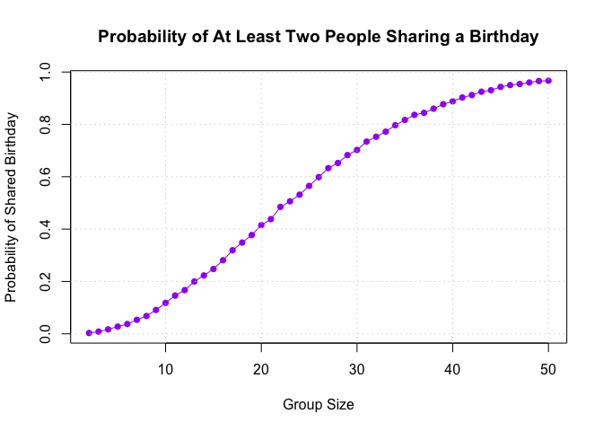
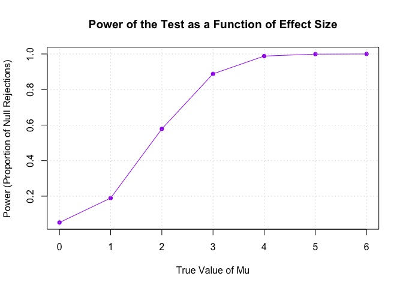
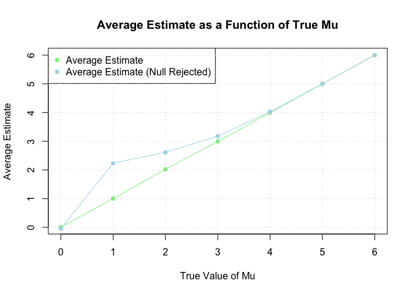
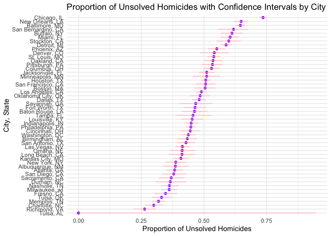

P8105_HW5_YX2953
================
2024-11-13

Problem 1

``` r
birthday_simulation <- function(group_size) {
  # Generate random birthdays for the group
  birthdays <- sample(1:365, group_size, replace = TRUE)
  # Check if there are any duplicate birthdays
  return(any(duplicated(birthdays)))
}

birthday_paradox_probabilities <- function(max_group_size = 50, simulations = 10000) {
  probabilities <- numeric(max_group_size - 1)
  
  for (group_size in 2:max_group_size) {
    # Run the simulation and calculate the probability of duplicate birthdays
    duplicates <- sum(replicate(simulations, birthday_simulation(group_size)))
    probabilities[group_size - 1] <- duplicates / simulations
  }
  
  return(probabilities)
}

# Run the simulation for group sizes 2 to 50
probabilities <- birthday_paradox_probabilities()

# Plot the probabilities
group_sizes <- 2:50
plot(group_sizes, probabilities, type = "o", pch = 16, col = "purple",
     xlab = "Group Size", ylab = "Probability of Shared Birthday",
     main = "Probability of At Least Two People Sharing a Birthday")
grid()
```

<!-- -->

Problem 2

``` r
library(broom)

n <- 30
sigma <- 5
alpha <- 0.05
mu_values <- c(0, 1, 2, 3, 4, 5, 6)
num_simulations <- 5000

# Create empty data frame to store results
results <- data.frame(mu = numeric(), estimate = numeric(), p_value = numeric())

# for each mu, sun the simulation 
for (mu in mu_values) {
  for (i in 1:num_simulations) {
    # Generate random sample from N(mu, sigma)
    x <- rnorm(n, mean = mu, sd = sigma)
    
    # Perform one-sample t-test
    t_test_result <- t.test(x, mu = 0)
    
    # Extract estimate and p-value
    tidy_result <- tidy(t_test_result)
    estimate <- tidy_result$estimate
    p_value <- tidy_result$p.value
    
    # Store results
    results <- rbind(results, data.frame(mu = mu, estimate = estimate, p_value = p_value))
  }
}

# Calculate power for each mu
power_results <- aggregate(p_value ~ mu, data = results, function(p) mean(p < alpha))

# Plot power as a function of effect size
plot(power_results$mu, power_results$p_value, type = "o", pch = 16, col = "purple",
     xlab = "True Value of Mu", ylab = "Power (Proportion of Null Rejections)",
     main = "Power of the Test as a Function of Effect Size")
grid()
```

<!-- -->

``` r
# Calculate average estimate and conditional average for null rejections
average_estimate <- aggregate(estimate ~ mu, data = results, mean)
average_reject_estimate <- aggregate(estimate ~ mu, data = subset(results, p_value < alpha), mean)

# Plot average estimate vs. true value of mu
plot(average_estimate$mu, average_estimate$estimate, type = "o", pch = 16, col = "lightgreen",
     xlab = "True Value of Mu", ylab = "Average Estimate",
     main = "Average Estimate as a Function of True Mu")
points(average_reject_estimate$mu, average_reject_estimate$estimate, type = "o", pch = 16, col = "lightblue")
legend("topleft", legend = c("Average Estimate", "Average Estimate (Null Rejected)"),
       col = c("lightgreen", "lightblue"), pch = 16)
grid()
```

<!-- -->
Description: The first plot shows that the power increases when the
effect size increases. When the effect size is larger than 4, the power
gets very close to 1.

The second plot shows that the sample average of mu^ across tests for
which the null is rejected tend to be larger than the true value of mu.
I think it is due to selection bias of hypothesis testing. We only
consider cases with significant results, especially with small sizes of
effects, so it will lead to overestimation of true effect.

Problem 3

Describe the raw data: This dataset provides detailed information on
individual homicide cases, allowing analysis of homicide resolution
rates, victim demographics and geographical trends. Some key variables
are city and state, which allows for grouping by location, dispositions,
which show the status of the homicide, etc.

``` r
# Load necessary libraries
library(dplyr)
```

    ## 
    ## Attaching package: 'dplyr'

    ## The following objects are masked from 'package:stats':
    ## 
    ##     filter, lag

    ## The following objects are masked from 'package:base':
    ## 
    ##     intersect, setdiff, setequal, union

``` r
library(broom)
library(tidyr)
library(purrr)
library(ggplot2)

# Load data (assuming the file is in your working directory)
homicide_data <- read.csv("homicide-data.csv", stringsAsFactors = FALSE)

# Inspect the raw data
str(homicide_data)
```

    ## 'data.frame':    52179 obs. of  12 variables:
    ##  $ uid          : chr  "Alb-000001" "Alb-000002" "Alb-000003" "Alb-000004" ...
    ##  $ reported_date: int  20100504 20100216 20100601 20100101 20100102 20100126 20100127 20100127 20100130 20100210 ...
    ##  $ victim_last  : chr  "GARCIA" "MONTOYA" "SATTERFIELD" "MENDIOLA" ...
    ##  $ victim_first : chr  "JUAN" "CAMERON" "VIVIANA" "CARLOS" ...
    ##  $ victim_race  : chr  "Hispanic" "Hispanic" "White" "Hispanic" ...
    ##  $ victim_age   : chr  "78" "17" "15" "32" ...
    ##  $ victim_sex   : chr  "Male" "Male" "Female" "Male" ...
    ##  $ city         : chr  "Albuquerque" "Albuquerque" "Albuquerque" "Albuquerque" ...
    ##  $ state        : chr  "NM" "NM" "NM" "NM" ...
    ##  $ lat          : num  35.1 35.1 35.1 35.1 35.1 ...
    ##  $ lon          : num  -107 -107 -107 -107 -107 ...
    ##  $ disposition  : chr  "Closed without arrest" "Closed by arrest" "Closed without arrest" "Closed by arrest" ...

``` r
head(homicide_data)
```

    ##          uid reported_date victim_last victim_first victim_race victim_age
    ## 1 Alb-000001      20100504      GARCIA         JUAN    Hispanic         78
    ## 2 Alb-000002      20100216     MONTOYA      CAMERON    Hispanic         17
    ## 3 Alb-000003      20100601 SATTERFIELD      VIVIANA       White         15
    ## 4 Alb-000004      20100101    MENDIOLA       CARLOS    Hispanic         32
    ## 5 Alb-000005      20100102        MULA       VIVIAN       White         72
    ## 6 Alb-000006      20100126        BOOK    GERALDINE       White         91
    ##   victim_sex        city state      lat       lon           disposition
    ## 1       Male Albuquerque    NM 35.09579 -106.5386 Closed without arrest
    ## 2       Male Albuquerque    NM 35.05681 -106.7153      Closed by arrest
    ## 3     Female Albuquerque    NM 35.08609 -106.6956 Closed without arrest
    ## 4       Male Albuquerque    NM 35.07849 -106.5561      Closed by arrest
    ## 5     Female Albuquerque    NM 35.13036 -106.5810 Closed without arrest
    ## 6     Female Albuquerque    NM 35.15111 -106.5378        Open/No arrest

``` r
# Create city_state variable
homicide_data <- homicide_data %>%
  mutate(city_state = paste(city, state, sep = ", "))

# Summarize within cities to obtain the total number of homicides and the number of unsolved homicides
homicide_summary <- homicide_data %>%
  group_by(city_state) %>%
  summarize(
    total_homicides = n(),
    unsolved_homicides = sum(disposition %in% c("Closed without arrest", "Open/No arrest"))
  )

# Filter for Baltimore, MD to perform proportion test
baltimore_data <- filter(homicide_summary, city_state == "Baltimore, MD")

# Run prop.test for Baltimore, MD
prop_test_result <- prop.test(baltimore_data$unsolved_homicides, baltimore_data$total_homicides)

# Tidy the prop.test output and extract the estimated proportion and confidence intervals
tidy_result <- broom::tidy(prop_test_result)
baltimore_proportion <- tidy_result %>%
  select(estimate, conf.low, conf.high)

# Display the result
print(baltimore_proportion)
```

    ## # A tibble: 1 × 3
    ##   estimate conf.low conf.high
    ##      <dbl>    <dbl>     <dbl>
    ## 1    0.646    0.628     0.663

``` r
# Define a function to run prop.test and tidy the result
run_prop_test <- function(unsolved, total) {
  prop_test_result <- prop.test(unsolved, total)
  tidy(prop_test_result)
}

# Use map2 to apply the prop.test function to each city and get proportions and CIs
homicide_summary <- homicide_summary %>%
  mutate(
    test_result = map2(unsolved_homicides, total_homicides, run_prop_test)
  ) %>%
  unnest(cols = test_result) %>%
  select(city_state, total_homicides, unsolved_homicides, estimate, conf.low, conf.high)
```

    ## Warning: There was 1 warning in `mutate()`.
    ## ℹ In argument: `test_result = map2(unsolved_homicides, total_homicides,
    ##   run_prop_test)`.
    ## Caused by warning in `prop.test()`:
    ## ! Chi-squared approximation may be incorrect

``` r
# Rename columns for clarity
homicide_summary <- homicide_summary %>%
  rename(
    proportion_unsolved = estimate,
    conf_lower = conf.low,
    conf_upper = conf.high
  )

# Display the tidy dataframe with estimated proportions and CIs for each city
print(homicide_summary)
```

    ## # A tibble: 51 × 6
    ##    city_state  total_homicides unsolved_homicides proportion_unsolved conf_lower
    ##    <chr>                 <int>              <int>               <dbl>      <dbl>
    ##  1 Albuquerqu…             378                146               0.386      0.337
    ##  2 Atlanta, GA             973                373               0.383      0.353
    ##  3 Baltimore,…            2827               1825               0.646      0.628
    ##  4 Baton Roug…             424                196               0.462      0.414
    ##  5 Birmingham…             800                347               0.434      0.399
    ##  6 Boston, MA              614                310               0.505      0.465
    ##  7 Buffalo, NY             521                319               0.612      0.569
    ##  8 Charlotte,…             687                206               0.300      0.266
    ##  9 Chicago, IL            5535               4073               0.736      0.724
    ## 10 Cincinnati…             694                309               0.445      0.408
    ## # ℹ 41 more rows
    ## # ℹ 1 more variable: conf_upper <dbl>

``` r
# Arrange the data by the proportion of unsolved homicides for plotting
homicide_summary <- homicide_summary %>%
  arrange(desc(proportion_unsolved))

# Plot with estimates and confidence intervals
ggplot(homicide_summary, aes(x = reorder(city_state, proportion_unsolved), y = proportion_unsolved)) +
  geom_point(color = "purple") +
  geom_errorbar(aes(ymin = conf_lower, ymax = conf_upper), width = 0.2, color = "pink") +
  coord_flip() +
  labs(
    title = "Proportion of Unsolved Homicides with Confidence Intervals by City",
    x = "City, State",
    y = "Proportion of Unsolved Homicides"
  ) +
  theme_minimal()
```

<!-- -->
